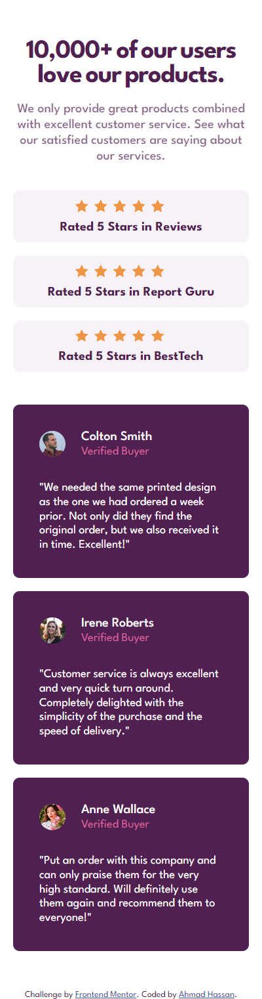
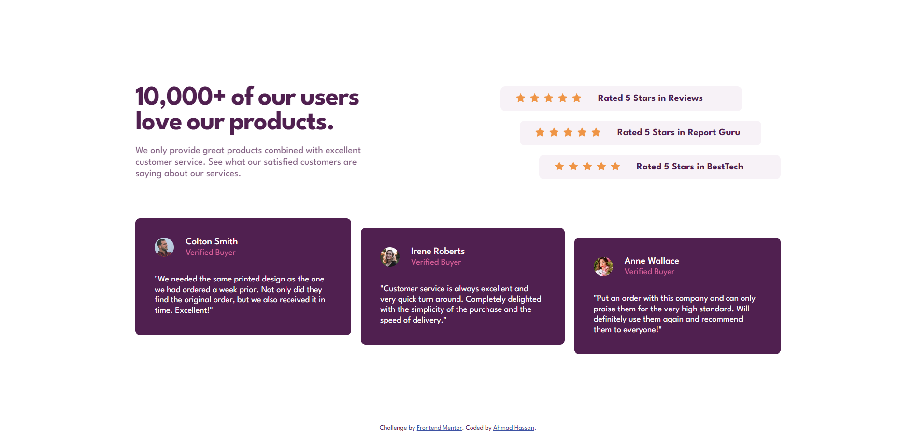

# Social Proof Section 👨‍💻

## Project Overview 🌟

This is a front-end coding challenge completed for [Frontend Mentor](https://www.frontendmentor.io). The challenge was to build a social proof section and make it look as close to the provided design as possible.

## Technologies Used 💻

- HTML
- CSS

### The Challenge 📋

The challenge required the following:

- View the optimal layout for the site depending on their device's screen size

## Screenshots 📷

| Mobile                                            | Desktop                                            |
| ------------------------------------------------- | -------------------------------------------------- |
|             |               |

## Live Demo 🚀

You can view the live demo of the project [here](https://social-proof-section-0010.netlify.app/).